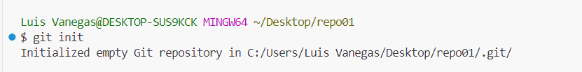

##  **Luis Vanegas**

##  Ejercicio 1.

#### Cree un directorio llamado "repo01"

#### Iniciale el la carpeta usando "Git Init"

### _Cree un archivo Readme.md que es en donde estas viendo esta informacion_

#### Agregar archivos y para verlos en el staging area. 

#### Agregar archivos y para verlos en el staging area. 

