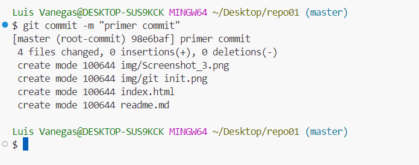

##  **Luis Vanegas**

##  Ejercicio 1.

#### Cree un directorio llamado "repo01"

#### Iniciale el la carpeta usando "Git Init"

 "Creando carpeta")

### _Cree un archivo Readme.md que es en donde estas viendo esta informacion_

#### Agregar archivos y para verlos en el staging area. 

#### Con los archivos agregados vamos a a hacer un commit para actualizar  

#### Ahora vamos a hacer el push pero arroja error 

Este error en particular se genera porque no estamos haciendo push a nada. 

Debemos crear un reporsitorio en GITHUB y lo conectamos. 

- #### Crear repo01 en github

-Conectar tu carpeta local con repositorio en GitHub esto se logra usando el los comandos. 

* git remote add origin https://github.com/LuisVanegasCOL/repo01.git

* git branch -M main <!--Esto para cambiar el nombre de Master a main -->
* git push -u origin main 

- - -
- #### Ya teniendo conectado el repositorio local con el de GitHub se puede hacer el push sin problemas

# FIN!!!!

>“¡Lo Logramosss!🔥🔥🔥🔥”